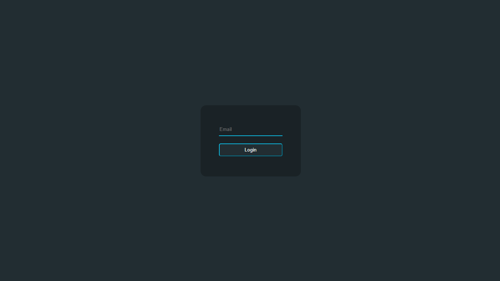

# Getting Started with Create React App

This project was bootstrapped with [Create React App](https://github.com/facebook/create-react-app).

## Available Scripts

In the project directory, you can run:

### `npm install`

### `npm start`

Runs the app in the development mode.\
Open [http://localhost:3000](http://localhost:3000) to view it in the browser.

The page will reload if you make edits.\
You will also see any lint errors in the console.

## The Welcome Page

 

 

## Login Page

 

 

## Loading Cars Page

 

 

## Cars View

 

 

## Create Car Page

 

 

## Not Found Item

 

 

## Favorites Cars Page

 

 
